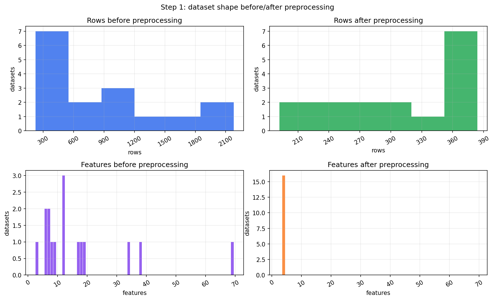
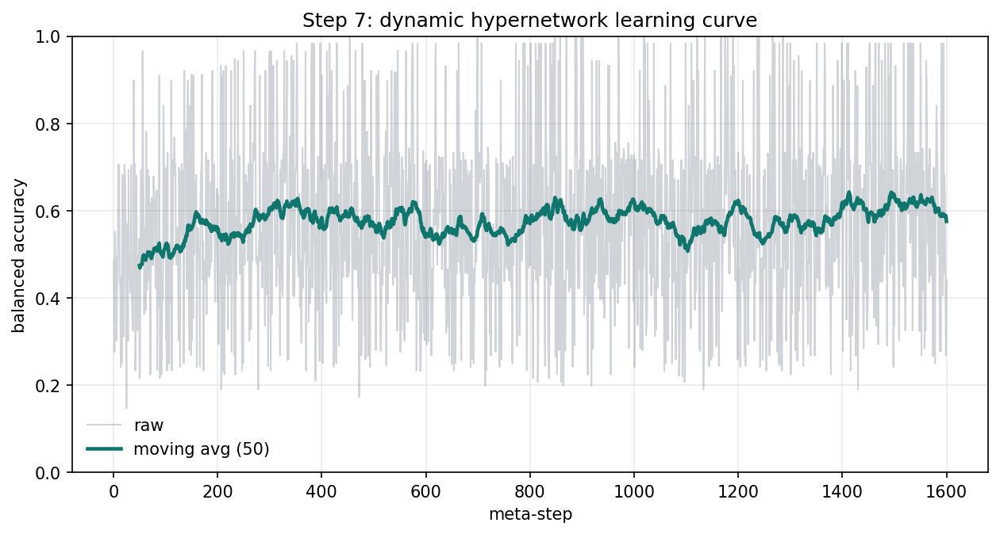
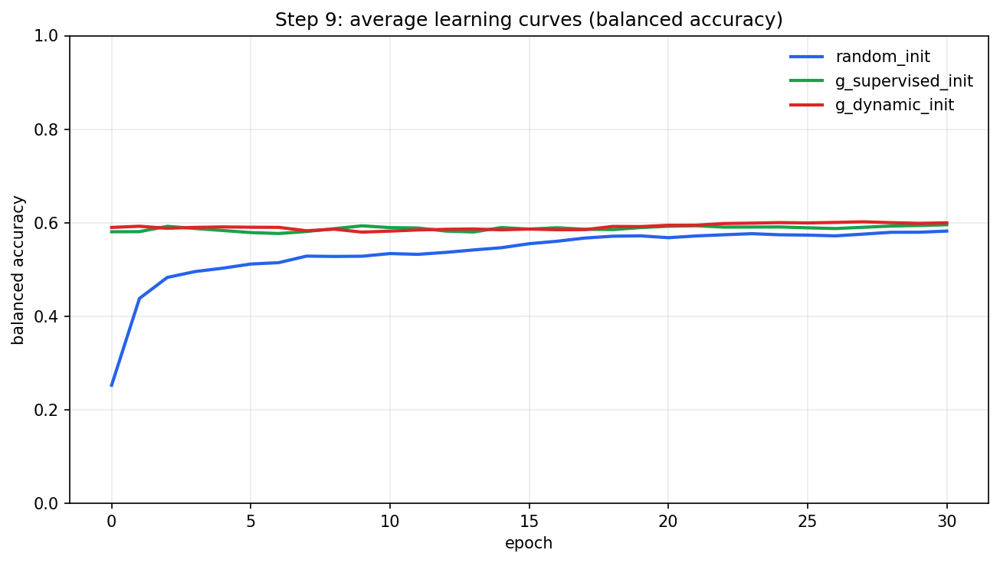
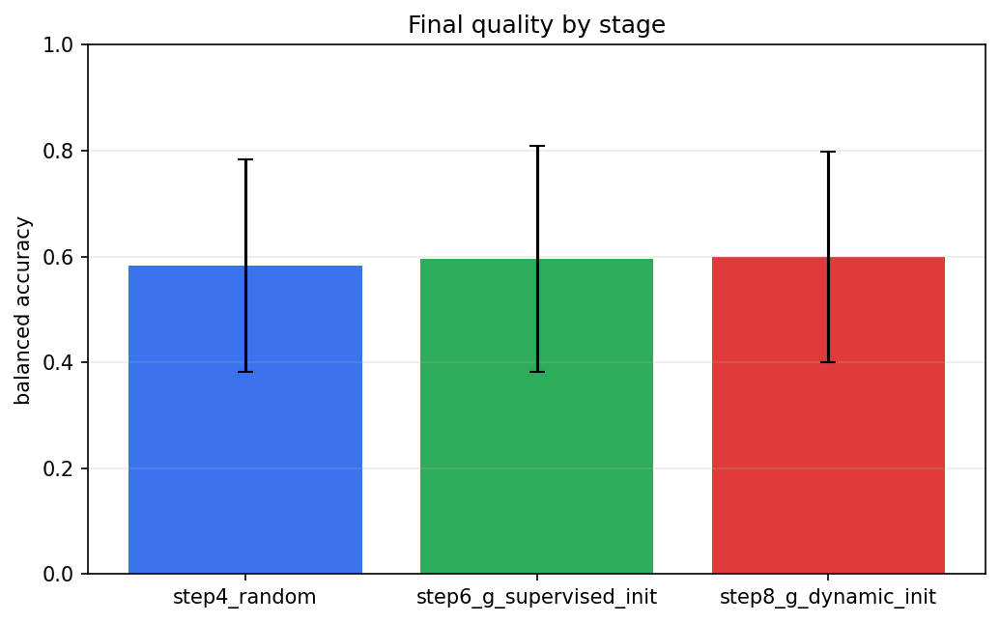

# Lab 3

##  Пункты
| Пункт | Что сделано | Файлы |
|---|---|---|
| 1 | Отбор и предобработка OpenML датасетов: баланс классов, сэмплирование, проекция к `K=C` | `outputs_k4_30/tables/processed_datasets.csv`, `outputs_k4_30/plots/preprocessing_hist.png` |
| 2 | Стратифицированный train/test split и выбор `balanced_accuracy` | `src/auto_lab3/preprocessing.py` |
| 3 | Усложненная сеть `f`: MLP (`4 -> 96 -> 48 -> 4`), loss `CrossEntropy`, optimizer `AdamW` | `src/auto_lab3/models.py` |
| 4 | Обучение `f` со случайной инициализацией на каждом датасете, средняя кривая, сохранение весов | `outputs_k4_30/models/f_random`, `outputs_k4_30/curves/step4_random_avg.csv` |
| 5 | Обучение гиперсети `g` (one-to-many) по мета-признакам -> параметры `f` | `outputs_k4_30/models/hypernets/g_supervised.pt`, `outputs_k4_30/tables/g_supervised_history.csv` |
| 6 | Повтор шага 4 с инициализацией `f` от `g` | `outputs_k4_30/models/f_g_supervised_init`, `outputs_k4_30/curves/step6_g_supervised_init_avg.csv` |
| 7 | Динамическое дообучение `g` через градиент риска через `f` и `g` | `outputs_k4_30/models/hypernets/g_dynamic.pt`, `outputs_k4_30/tables/g_dynamic_history.csv`, `outputs_k4_30/plots/dynamic_curve.png` |
| 8 | Повтор шага 6 с динамически обученной `g` | `outputs_k4_30/models/f_g_dynamic_init`, `outputs_k4_30/curves/step8_g_dynamic_init_avg.csv` |
| 9 | Сравнение средних кривых обучения | `outputs_k4_30/plots/learning_curves_compare.png`, `outputs_k4_30/tables/stage_summary.csv` |

## Основные результаты
| Этап | Mean final balanced_accuracy | Std |
|---|---:|---:|
| Step 4: random init | 0.5821 | 0.2008 |
| Step 6: init from supervised g | 0.5956 | 0.2143 |
| Step 8: init from dynamic g | 0.5997 | 0.1994 |

## Выводы по результатам
- Значения в диапазоне `~0.58-0.60` получились из-за текущей постановки: после предобработки у каждого датасета только `4` класса и `4` признака, но сами датасеты остаются разнородными, поэтому средний результат умеренный, а разброс заметный.
- `Std` около `0.20` означает, что качество сильно зависит от конкретного датасета: на части задач модель работает существенно лучше, на части хуже.
- `Step 6` и `Step 8` близки, потому что обе гиперсети в основном решают одну задачу: дать хорошую инициализацию для `f`. После этого `f` все равно дообучается `30` эпох, и это частично сглаживает разницу между инициализациями.
- Динамическая гиперсеть слегка лучше по финалу (`0.5997` против `0.5956`) и по стабильности (`std 0.1994` против `0.2143`), но прирост небольшой, потому что в этой конфигурации основную часть качества добирает уже само дообучение `f`.
- Итог: гиперсети дают выигрыш относительно random (`+0.0135` и `+0.0176` по mean final), а разница между обычной и динамической гиперсетью ограничена из-за последующего достаточно длинного обучения `f`.

## Визуализации
### Шаг 1: датасеты до/после предобработки

### Шаг 7: динамическое обучение гиперсети

### Шаг 9: сравнение кривых обучения

### Сравнение финального качества

