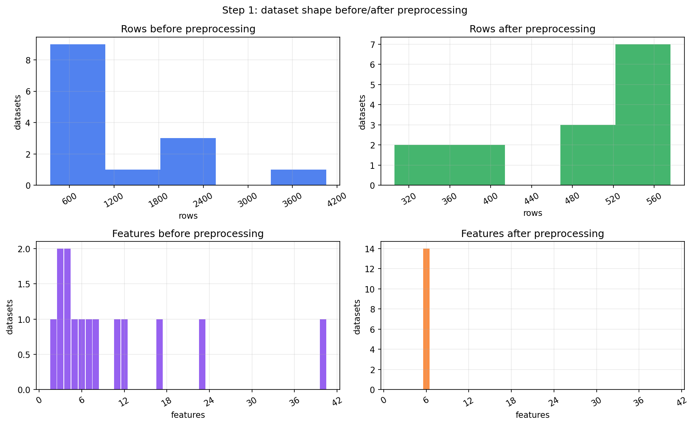
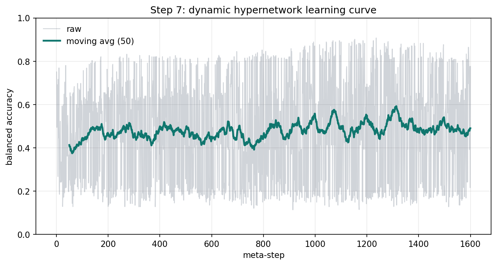
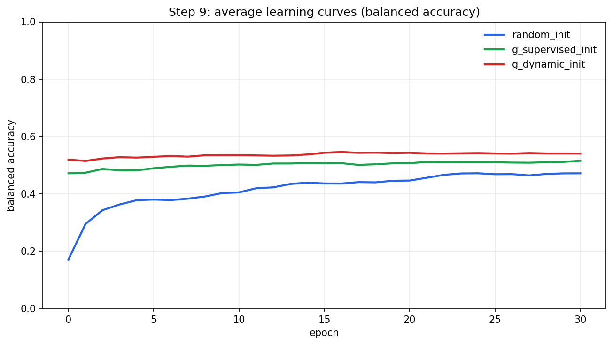
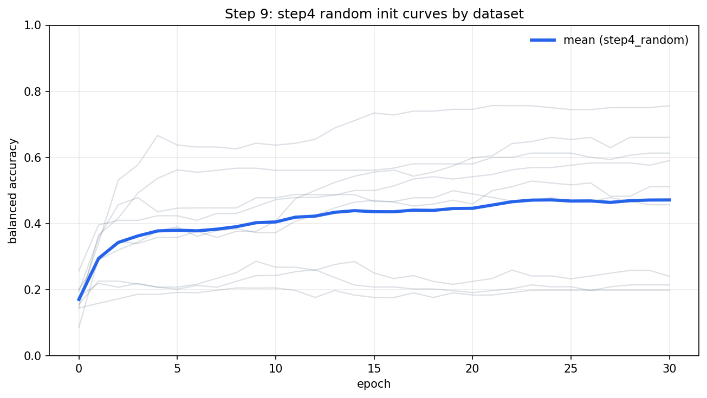
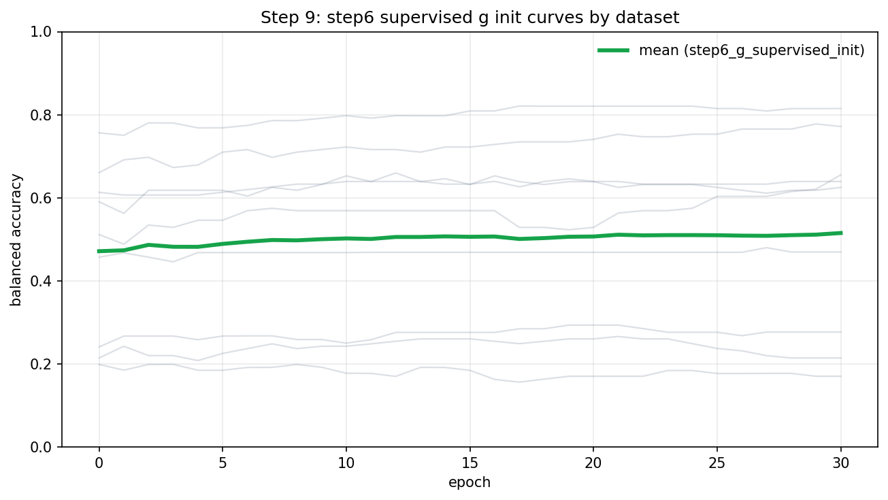
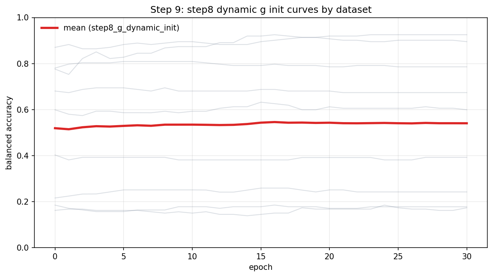

# Lab 3

## По пунктам задания
| Пункт | Что сделано | Файлы |
|---|---|---|
| 1 | Отбор и предобработка OpenML датасетов: баланс классов, сэмплирование, проекция к `K=C` | `outputs/tables/processed_datasets.csv`, `outputs/plots/preprocessing_hist.png` |
| 2 | Стратифицированный train/test split и выбор `balanced_accuracy` | `src/auto_lab3/preprocessing.py` |
| 3 | Усложненная сеть `f`: MLP (`6 -> 96 -> 48 -> 6`), loss `CrossEntropy`, optimizer `AdamW` | `src/auto_lab3/models.py` |
| 4 | Обучение `f` со случайной инициализацией на каждом датасете, средняя кривая, сохранение весов | `outputs/models/f_random`, `outputs/curves/step4_random_avg.csv` |
| 5 | Обучение гиперсети `g` (one-to-many) по мета-признакам -> параметры `f` | `outputs/models/hypernets/g_supervised.pt`, `outputs/tables/g_supervised_history.csv` |
| 6 | Повтор шага 4 с инициализацией `f` от `g` | `outputs/models/f_g_supervised_init`, `outputs/curves/step6_g_supervised_init_avg.csv` |
| 7 | Динамическое дообучение `g` через градиент риска через `f` и `g` | `outputs/models/hypernets/g_dynamic.pt`, `outputs/tables/g_dynamic_history.csv`, `outputs/plots/dynamic_curve.png` |
| 8 | Повтор шага 6 с динамически обученной `g` | `outputs/models/f_g_dynamic_init`, `outputs/curves/step8_g_dynamic_init_avg.csv` |
| 9 | Сравнение средних кривых обучения и кривых по каждому датасету | `outputs/plots/learning_curves_compare.png`, `outputs/plots/step4_curves_with_mean.png`, `outputs/plots/step6_curves_with_mean.png`, `outputs/plots/step8_curves_with_mean.png`, `outputs/tables/stage_summary.csv` |

## Основные результаты
| Этап | Mean final balanced_accuracy | Std |
|---|---:|---:|
| Step 4: random init | 0.4714 | 0.2081 |
| Step 6: init from supervised g | 0.5152 | 0.2427 |
| Step 8: init from dynamic g | 0.5405 | 0.3026 |

## Визуализации
### Шаг 1: датасеты до/после предобработки

### Шаг 7: динамическое обучение гиперсети

### Шаг 9: сравнение кривых обучения

### Шаг 9: Step 4 (все датасеты + средняя)

### Шаг 9: Step 6 (все датасеты + средняя)

### Шаг 9: Step 8 (все датасеты + средняя)

### Сравнение финального качества

